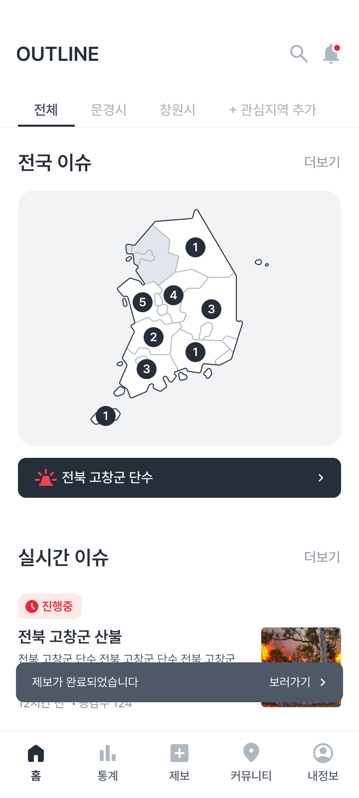
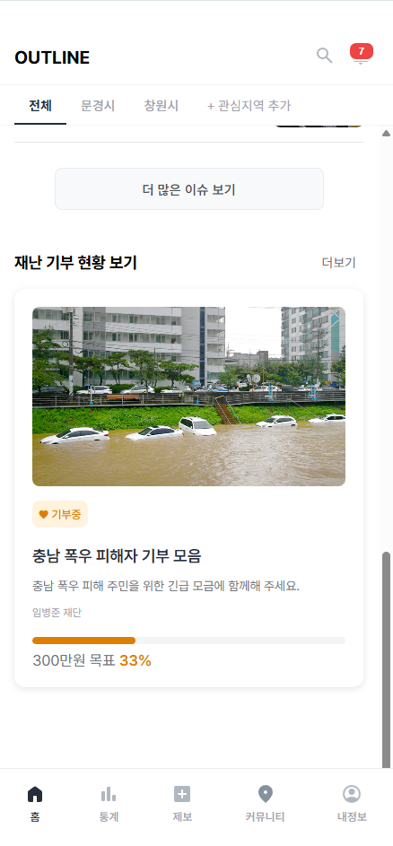
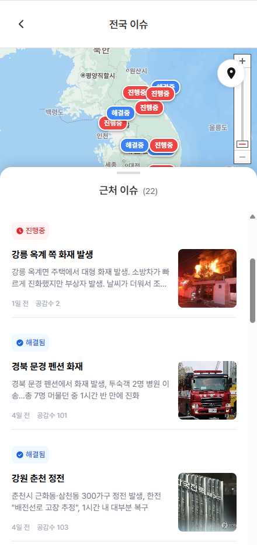
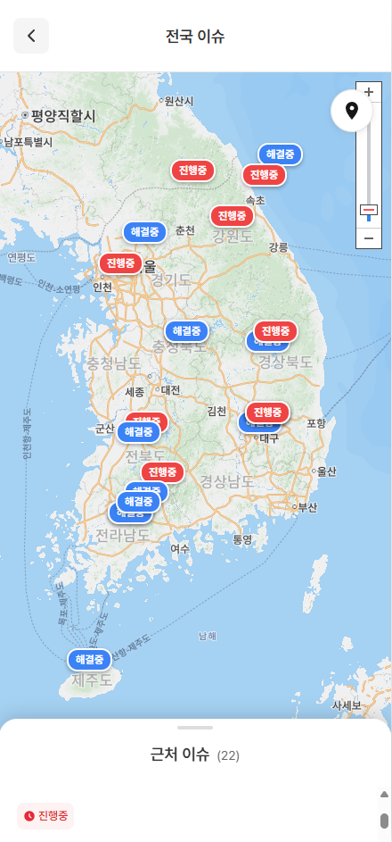
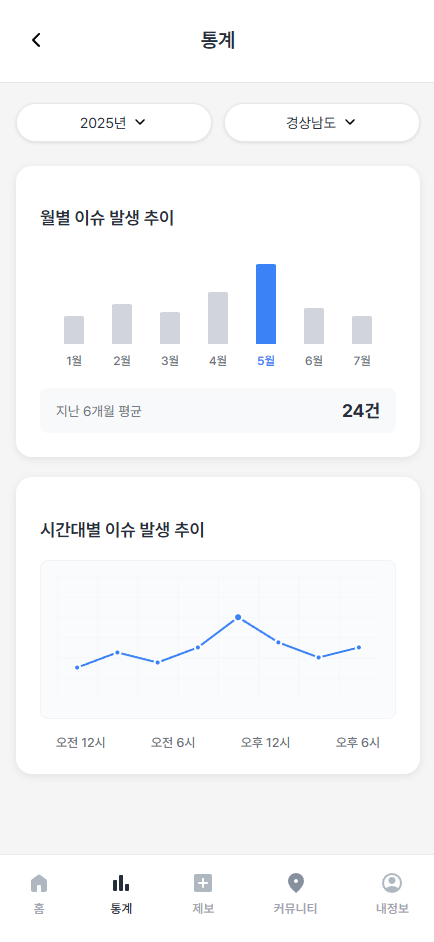

# OUTLINE – 실시간 지역 이슈 제보/공감 플랫폼

> Notion: https://enchanting-browser-cb9.notion.site/BE-242d237470108003aac4ce8d1240970a?source=copy_link

OUTLINE은 지역 사회의 크고 작은 이슈를 누구나 자유롭게 제보하고,  
다른 사용자들이 공감과 해결을 통해 함께 사회적 가치를 만드는 실시간 참여형 플랫폼입니다.  
AI 기반 요약 기능과 자동 알림 기능을 통해 사용자의 참여와 문제 해결을 연결합니다.

---

## 🚀 주요 기능

### 사용자 인증
- ID 기반 로그인 및 자동 회원가입
- 사용자 정보 조회

### 게시글 등록 & 요약
- 게시글 등록 시 GPT API를 통한 AI 요약 자동 생성
- 이미지 업로드, 지역 설정, 상태(해결 여부) 포함

### 게시글 조회
- 전체, 상세, 내가 쓴 글, 내가 공감한 글 목록 제공
- 게시글 요약 단건 조회 (카드뉴스용)

### 공감/해결 기능
- 게시글에 공감/해결 버튼 제공
- 공감수 100 → 작성자에게 이메일 & 알림 전송
- 해결수 5 → 해결 유저에게 알림 + 상태 변경

### 관심 지역 설정
- 지역 코드 기반 등록/삭제
- 관심 지역에 새 글이 등록되면 자동 알림 제공

### 알림 기능
- 공감/해결/관심지역 발생 시 자동 알림
- 사용자별 알림 목록 조회

---

## 주요 기능 스크린샷
<p align="center">
  
  
  
  
  
</p>


---

## ⚙ 기술 스택

| 분류        | 기술                         |
|-------------|------------------------------|
| Language    | Java 17                      |
| Framework   | Spring Boot 3.x              |
| ORM         | Spring Data JPA              |
| DB          | MySQL 8                      |
| Auth        | JWT, Spring Security         |
| Infra       | AWS EC2, Docker, Nginx       |
| Mail        | AWS SES                      |
| AI 연동     | OpenAI GPT-4 (요약 기능)     |
| 문서화      | Swagger (Springdoc OpenAPI)  |

---

## 🧾 ERD 요약

| 테이블 | 설명 |
|--------|------|
| `User`          | 사용자 정보 |
| `Post`          | 제보 게시글 |
| `post_like`     | 공감 기록 |
| `post_solve`    | 해결 기록 |
| `post_summary`  | GPT 요약 데이터 |
| `region`        | 관심 지역 설정 |
| `notification`  | 알림 메시지 |

※ 상세 필드는 Notion 또는 Schema 문서 참고

---

## 📁 디렉토리 구조
```
src/main/java/com/outline
├── auth/             # 로그인 및 사용자 인증 관련 (자동 회원가입 포함)
├── config/           # Spring Security, Swagger, CORS 등 글로벌 설정 파일
├── email/            # 이메일 발송 서비스 (SES 연동 포함)
├── file/             # 이미지 업로드 관련 로직
├── like/             # 게시글 공감(Like) 기능
├── notification/     # 알림(Notification) 전송 및 조회 처리
├── post/             # 게시글 CRUD + 요약(PostSummary) 포함
├── region/           # 사용자 관심지역 등록 및 알림 연동
├── solve/            # 해결(Solve) 기능 및 상태 변경 처리
├── user/             # 사용자 조회, 공감수/해결수 통계 등 유저 정보 관리
```

---

## 📌 API 명세서

| 기능 | Method | Endpoint |
|------|--------|----------|
| 로그인 / 회원가입 | POST | `/auth/login` |
| 게시글 등록 | POST | `/posts` |
| 게시글 전체 조회 | GET | `/posts` |
| 게시글 요약 조회 | GET | `/posts/{postId}/summary` |
| 공감 등록/취소 | POST / DELETE | `/likes` |
| 해결 등록/취소 | POST / DELETE | `/solve` |
| 관심지역 등록/조회 | POST / GET | `/regions` |
| 알림 목록 조회 | GET | `/notifications/{userId}` |

---

## 🧪 실행 방법 (로컬)

1. `.env` 또는 `application.yml` 설정
   - DB, AWS, OpenAI, SES, CORS 설정
2. Docker 설치
3. `./gradlew build`
4. `docker-compose up -d`
5. Swagger 접속: `http://localhost:8080/swagger-ui/index.html`

---

## 👥 팀 정보

**로컬프렌즈 10팀 - OUTLINE**  
- 백엔드: 김태희
- 프론트: 이소연
- 기획: 임병준, 염상우
- 디자인: 박요한, 유진

---

## 📌 배운 점 & 느낀 점

- AI 요약 도입을 통한 GPT 실전 활용
- 공감/해결/관심지역 기반 알림 설계로 UX 개선 경험
- Docker + EC2 + GitHub Actions를 이용한 CI/CD 파이프라인 구축
- 실시간 참여 기반 서비스에 필요한 도메인 분리 및 책임 설계 

---


